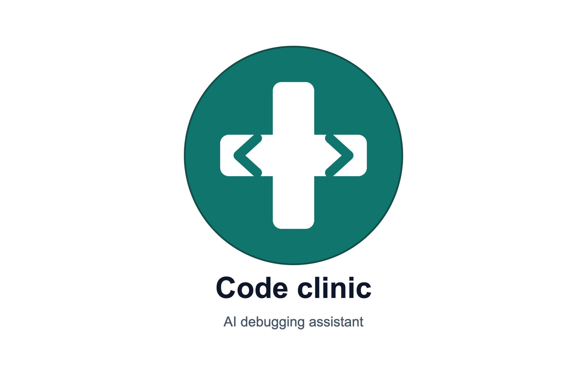
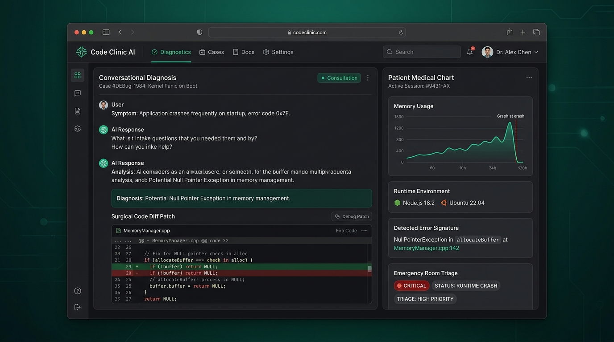
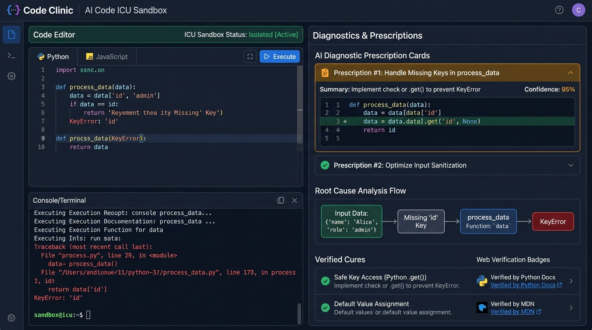
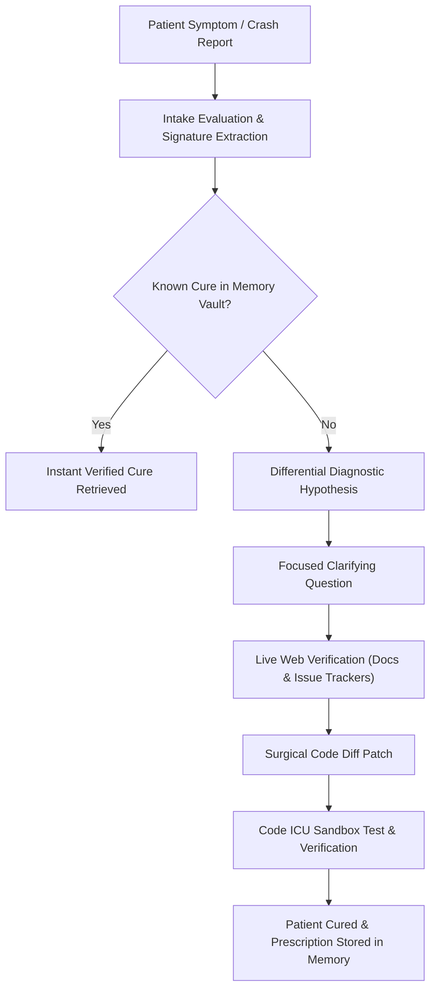

<p align="center">
  
</p>

<h1 align="center">Code Clinic</h1>

<p align="center">
  <strong>The AI Debugging Doctor — Conversational diagnostics, surgical patches, and isolated sandbox verification.</strong>
</p>

<p align="center">
  <a href="https://github.com/allanindrajith/code-clinic/blob/main/LICENSE"></a>
  <a href="https://nodejs.org/"></a>
  <a href="https://github.com/allanindrajith/code-clinic/stargazers"></a>
  <a href="https://github.com/allanindrajith/code-clinic/issues"></a>
  <a href="https://github.com/allanindrajith/code-clinic/pulls"></a>
</p>

---

## 🩺 Overview

**Code Clinic** operates like a senior consulting physician doing real-time pair debugging with developers. 

Unlike conventional chatbots that dump massive, hallucinated blocks of generic code, **Code Clinic**:
1. **Performs an Intake Evaluation** — listens to symptoms, error logs, and stack traces.
2. **Asks ONE focused diagnostic question at a time** — isolating the actual root cause rather than guessing.
3. **Runs Real-Time Web Verification** — queries official documentation and community issue trackers for breaking changes (e.g. Next.js 15, Python 3.12+, React 19).
4. **Delivers Surgical Code Patches** — clean, git-diff style patches touching only the diseased lines.
5. **Maintains a Patient Medical Chart & ICU Sandbox** — tracks session context, environment details, and allows isolated code testing.

---

## 🖥️ Application Preview

### 1. Conversational Diagnosis & Patient Medical Chart
<p align="center">
  
</p>

*Step-by-step diagnostic workflow: real-time patient symptom intake, differential diagnosis hypothesis, surgical diff patch with syntax highlighting, and live patient chart monitoring.*

---

### 2. Code ICU Sandbox & Diagnostics Playground
<p align="center">
  
</p>

*In-browser isolated execution laboratory supporting multiple runtimes, real-time terminal output, diagnostic prescription cards, root cause analysis flow, and verified documentation badges.*

---

## ⚡ Key Features

- **Dr. Debug Diagnostic Engine**:
  - Conversational intake that respects developer focus.
  - Socratic questioning to identify repro steps and environmental variables.
  - Generates minimal surgical diffs (green additions / red deletions) rather than rewriting whole files.

- **Patient Medical Chart**:
  - Dynamic telemetry tracking detected languages, frameworks, runtime versions, and crash signatures.
  - Memory persistence across consultation rounds.

- **Emergency Room (ER) Triage Presets**:
  - Pre-loaded instant clinical cases for common headaches:
    - *Next.js 15 `cookies()` breaking async change*
    - *Python `asyncio.get_event_loop()` closed event loop*
    - *React `Cannot read property of undefined (reading 'map')`*
    - *Docker socket permission & volume bind mounts*

- **Code ICU Sandbox**:
  - In-browser execution laboratory for rapid reproduction and live patch verification.
  - Runtime environment isolation with console/terminal logs.

- **Clinical Memory Vault (RAG Learning Store)**:
  - "Learning while doctor cures" feedback loop.
  - Solved bugs and verified cures are indexed locally in `data/clinic_memory.json` for rapid retrieval in future sessions.

---

## 🔄 Diagnostic Workflow



---

## 🚀 Quickstart

### Prerequisites
- [Node.js](https://nodejs.org/) v18.0.0 or higher
- Git

### Installation

1. **Clone the repository:**
   ```bash
   git clone https://github.com/allanindrajith/code-clinic.git
   cd code-clinic
   ```

2. **Start the local server:**
   ```bash
   node server.js
   ```

3. **Open in browser:**
   ```text
   http://127.0.0.1:3000
   ```

---

## 📂 Project Structure

```text
code-clinic/
├── data/
│   └── clinic_memory.json        # Persistent clinical memory and RAG cures
├── docs/
│   └── images/
│       ├── code_clinic_preview.jpg  # Full consultation & patient chart preview
│       └── code_icu_sandbox.jpg     # Code ICU execution laboratory preview
├── logo/
│   ├── code_clinic_logo.png      # Official raster brand mark
│   └── code_clinic_logo.svg      # Scalable vector logo
├── public/
│   ├── app.js                    # Client-side state, chat stream, & sandbox logic
│   ├── index.html                # Semantic HTML5 single-page application
│   ├── mascot.svg                # Dr. Debug Owl mascot
│   └── styles.css                # Polished design system (Ollama-inspired aesthetic)
├── clinic_engine.js              # Diagnostic reasoning, triage patterns, & memory
├── code-clinic-bot-blueprint.md  # Comprehensive product and engine blueprint
├── DESIGN.md                     # Design system specifications & style guide
├── LICENSE                       # MIT License
├── package.json                  # Application metadata and scripts
├── server.js                     # Zero-dependency Node.js HTTP & API server
└── README.md                     # Documentation and project manual
```

---

## ⚙️ Configuration & Doctor Settings

Code Clinic comes ready out-of-the-box with a local heuristic diagnostic engine. You can also connect external LLM providers in **Doctor Settings**:
- **Diagnosis Depth**: Fast Triage vs Comprehensive Specialist
- **Sandbox Timeout**: Custom execution threshold (1s - 30s)
- **Clinical Memory**: Toggle automatic storage of verified cures

---

## 🤝 Contributing

Contributions, bug reports, and triage preset suggestions are welcome!

1. Fork the Project (`gh repo fork allanindrajith/code-clinic` or click Fork on GitHub)
2. Create your Feature Branch (`git checkout -b feature/AmazingDiagnostic`)
3. Commit your Changes (`git commit -m 'Add new ER triage scenario'`)
4. Push to the Branch (`git push origin feature/AmazingDiagnostic`)
5. Open a Pull Request

---

## 📄 License

Distributed under the **MIT License**. See [`LICENSE`](./LICENSE) for more information.

---

<p align="center">
  Crafted with care by <a href="https://github.com/allanindrajith">Allan Indrajith</a>.
</p>
